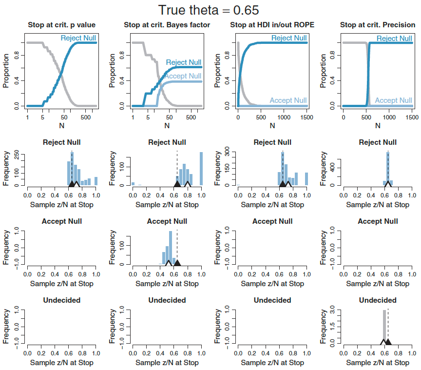

---
title: '目標, 検定力, サンプルサイズ'
author: "竹林由武"
date: "2017/9/07"
output: 
  ioslides_presentation:
    css: css/slide.css
    smaller: true
    incremental: true
---


```{r setup, include=FALSE}
rm(list=ls())
knitr::opts_chunk$set(echo = FALSE,message=F,error=F)
```

## Topics
<div class="columns-2">

```{r,out.width = "350px",out.hight = "500px"}

```

### 第13章の内容
### 1. 検定力
### 2. 検定力の検討手順
### 3. 1枚コイントスの例数設計
### 4. 階層モデルの例数設計
### 5. 精度を目標にする利点
### 6. おまけ

</div>

[犬4匹本をポチる](https://www.amazon.co.jp/dp/4320113160/ref=cm_sw_r_tw_dp_x_LDpRzbCTSAEZV)


## 本家のコード

```{r,out.width = "550px",out.hight = "100px"}

```

```{r,out.width = "450px",out.hight = "200px"}

```

## 本家のコード
### 以下のscriptをを一部改変して使っています

```{r,echo=T,eval=F}
DBDA2E-utilities.R # 便利関数 


Stan-Ydich-XnomSsubj-MbinomBetaOmegaKappa-Power.R  # 第13章タッチセラピーの例数設計


Stan-Ydich-XnomSsubj-MbinomBetaOmegaKappa.R # タッチセラピーモデルのベイズ推定コード

```

- 9章、10章を理解していると、この章は分かりやすい
- 著者の自作関数を読み解くとこが結構疲れる

- 想定はStan中級者 (階層モデルはいけるぜ！)


## ポエム

#### 僕がいつでも側にいるってことをあの子が信じるまで   
(Just how many times must I show her I care,)  

#### 僕があの子を気にかけていることをあと何度示せば良いのだろう？  
(Until she believes that I'll always be there?)     

#### そう、あの子は僕の価値が十分であることを否定するから、  
(Well, while she denies that my value's enough,)    

#### 僕は愛の力に頼らざるを得ない  
(I'll have to rely on the power of love)    

<div class="centered">
###  無視！！
</div>

---------

と言いつつ...

愛の力=$検定力$     僕の価値=$目標とするパラメータ値$     あの子=$査読者$  

####　
####　
####  確信を持って差があると査読者が信じるまで   
####　
####  査読者にどうしたら伝えられるか？  
####　
####  査読者が差があることを否定し続けるなら、　　
####　
####  検定力を示せばいいじゃん 
　　
　　
<div class="centered">　　

### 「あれ? 検定力って頻度論の話じゃ...？」

</div>


--------

### 頻度論の検定力 (1-β)


|   	|帰無仮説が真(差なし)   	|帰無仮説が偽 (差あり)   	|
|---:	|:---:	|:---:	|
|検定結果偽(差なし)|   1-α	|β   	|
|検定結果真(差あり)|   α	|  1-β 	|


Table:  帰無仮説が偽 (真に差があり)の時、正しく帰無仮説を棄却する確率  

Note: α= Type 1 error, β= Type 2 error
  
    
### 　      
### ベイズ流の検定力 (Kruschke, 2014)

#### ***目標を達成する確率(power)***  
####　
####    目標: ベイズ流では大きく3つ   
####    目標: 頻度論では一つ (帰無仮説の棄却)  


## ３つの目標

### 1. パラメータの空値を棄却する
> 例えば、歪んたコインで表が出る確率がチャンスレベル(50%)の周辺から外れているか

### 2. パラメータ推定を正確に行う
>  事後分布の幅の狭さ

### 3. パラメータの予測値を確認する
> 予測値の尤もらしさ、予測区間


## 目標をHDIで定式化

### 1. パラメータの空値を棄却する
> 空値周辺の実践的に等価な範囲(ROPE)が事後分布の95%HDIを含まないことを示す

### 2. パラメータ推定を正確に行う
>  事後分布の95%HDIが特定の最大幅より狭いことを示す

### 3. パラメータの予測値を確認する
> 事後分布の95%HDIを含む予測値のROPEを示す

<div class="centered">　

### ここでは上二つを扱います

</div>


## 目標1. 事後分布の95%HDI、ROPE外
###  例) 2群間の平均値差がゼロではない
> 事後分布の95%HDIの下限が、ROPEの上限以下

```{r, message=F, warning=F, include=FALSE, result="hide"}
library(BEST)
load("forPlot/plot1.Rdata")
```

```{r, message=F, echo=F,warning=F}
plot(plot1[[1]],ROPE=c(-0.5,0.5),which="mean")
```

- 帰無仮説検定の目標と類似

----------

###  例)  2群間の平均値差がゼロではない
> 事後分布の95%HDIの上限が、ROPEの下限以下


```{r, message=F, echo=F,warning=F}
plot(plot1[[2]],ROPE=c(-0.5,0.5),which="mean")
```


----------

###  例)  事後分布の95%HDIがROPE内
> 事後分布の95%HDIが、ROPE[-0.7,0.7]以内

```{r, message=F, echo=F,warning=F}
plot(plot1[[3]],ROPE=c(-0.7,0.7),which="mean")
```


## 目標2. パラメータ推定を正確に行う
>  事後分布の95%HDIが特定の最大幅より狭いことを示す

```{r, message=F, echo=F,warning=F,out.width = "650px",out.hight = "550px"}
plot(plot1[[2]],ROPE=c(-0.5,0.5),which="mean")
```
  
#### 目標とする精度 = -2 ± 1.5 [-3.5, -0.5] -> 目標不達成  
#### 目標とする精度 = -2 ± 1 [-3.0, -1.0] -> 目標達成


##  例数設計の必要性 

#### サンプルサイズが大きいと検定力は高くなる
####　
#### ただし、データ収集にはコストがかかる
####　
#### 無駄に大きなデータを収集することは非倫理的(特に臨床研究で)
####　
####　

<div class="centered">　　

###  望ましい検定力を達成する為に必要とされる
###  最小限のサンプルサイズを知りたい

</div>


## 検定力の検証フロー

#### 1. パラメタ分布の仮説設定      
####　
#### 2. 仮説分布からパラメタ値を生成      
####　    
#### 3. パラメタ値からデータ生成 
####　
#### 4. 生成されたデータでベイズ推定, 目標達成チェック    
####　
#### 5. 1~4を繰り返し、目標達成確率を検証    

## フロー図{#myImagePage}


#### このフローが全て、ここを覚えたらもう帰っていいよ

## 目標の設定

### 空値を除外
#### 豊富な先行研究があって, 高度に正確なデータ生成仮説が設定可能な場合
####　
####　
### 精度の幅
#### データ生成仮説がやや曖昧, 追試におけるバイアス減少
####　
####　
#### 探索的な研究が多い、社会科学系では後者が生きてくる
#### 空値を除外する目標の問題は後述


## 例数設計 1枚のコイン

### 目標: コインが不公平であることを示したい
### 定式化: ***95%HDIがθ=0.50のROPE外である*** (空値外し)

### 定式化: ***95%HDIがθ=0.65±0.2である*** (精度固め)　
###　
### フロー1: 仮説パラメタの分布設定
> 2000回投げて,65%が表になる

```{r, echo=T}
#仮説パラメタ分布のモード (ω)と集中度 (κ)を指定
kappa= 2000 #2000回投げて
omega= 0.65 # 65%が表
```


---------

### フロー2: 仮説パラメタ分布からランダムにパラメタ値生成

```{r, echo=T}
genPriorA = omega * (kappa-2) + 1 #β分布のaパラメタに変換
genPriorB = ( 1.0 - omega ) * (kappa-2) + 1 # β分布のbパラメタに変換

genTheta<-rbeta(1,genPriorA,genPriorB) #パラメタ値生成

```


### フロー3: パラメタ値に基づいてランダムなデータを生成

```{r,echo=T}
sampleN=74 # サンプルサイズを指定
sampleZ<-rbinom(1,size=sampleN,prob=genTheta) # データ生成
simulatedData<-c(rep(1,sampleZ),rep(0,sampleN-sampleZ)) # 0,1ベクトルに変換
simulatedData
```


-------------

### フロー4: 生成されたデータをMCMC


```{r, echo=T}

model_strings<-'
data{
  int N;
  int y[N];
}
parameters{
real<lower=0,upper=1> theta;
}
model{
theta ~ beta(1,1); #懐疑的な事前分布
y ~ bernoulli(theta);
}
'
```


```{r, echo=T, results="hide", message=F, erro=F, eval=F}
library(rstan)
model<-rstan::stan_model(model_code=model_strings)
fit<-rstan::sampling(model,data=list(N=sampleN,y=simulatedData))
```


##  事後分布の95%HDIが空値のROPE外？
***95%HDI=[0.492, 0.712]、ROPE=[0.48, 0.52]***  
ROPEの上限が95%HDIの下限を含むのでアウト!!!

```{r,echo=F, message=F,fig.height=2,fig.width=6}
load("data/fit1.Rdata")
rstan::stan_plot(fit,ci_level=0.95, show_density=T)
```

#### 補足) 事後分布から95%HDIを求める


```{r, echo=T}
Null_val<-0.5 # 空値
ROPE<- c(Null_val-0.02,Null_val+0.02) # ROPE
theta.fit<-rstan::extract(fit)$theta  # 事後分布のtheta値を抽出
thetaHDI_95<-quantile(theta.fit, probs=c(0.025,0.975)) #事後分布の95%HDIを算出
thetaHDI_95
```


##  事後分布の95%HDは望ましい精度か？

95%HDIの幅=0.220, 望ましい幅(精度)=0.2なのでアウト

```{r,echo=F, message=F,fig.height=2,fig.width=4}
rstan::stan_plot(fit,ci_level=0.95, show_density=T)
```


```{r, echo=T}
(thetaHDI_95[2]-thetaHDI_95[1])<0.2 
```

#### 重要なポイント
>  空値外しも精度もいずれの目標も事後分布から求められる

あとはこのフローを繰り返す(1000回とか任意の回数反復)    
何回目標達成したかをカウントし目標達成確率を求める＝検定力


## シミュレーションのコード{.presc}
 
```{r, echo=T, eval=F}
# コイントスのstanコード
model_strings<-'
data{
int N;
int y[N];
}
parameters{
real<lower=0,upper=1> theta;
}
model{
theta ~ beta(1,1);
y ~ bernoulli(theta);
}
'

# stanコードをコンパイル
library(rstan)
model<-rstan::stan_model(model_code=model_strings)


# データ生成関数
simData.binom<-function(omega, kappa,sampleN){
  #kappa= 2000 #2000回投げて
  #omega= 0.65 # 65%が表
  
  #sampleN=74 # サンプルサイズを指定
  
  genPriorA = omega * (kappa-2) + 1 #β分布のaパラメタに変換
  genPriorB = ( 1.0 - omega ) * (kappa-2) + 1 # β分布のbパラメタに変換
  
  genTheta<-rbeta(1,genPriorA,genPriorB) #パラメタ値生成
  sampleZ<-rbinom(1,size=sampleN,prob=genTheta) # データ生成
  simulatedData<-c(rep(1,sampleZ),rep(0,sampleN-sampleZ)) # 0,1ベクトルに変換
  return(simulatedData)
  
}


#目標達成関数
goalAchievedForSample <- function(fit,ROPE,W) {
  thetaROPE = ROPE
  thetaHDImaxWid= W
  
  # 95%HDIを算出
  thetaHDI<-as.vector(quantile(rstan::extract(fit)$theta,probs=c(0.025,0.975)))
  
  # 目標: 空値ROPE除外
  goalAchieved =list()
  goalAchieved = c(goalAchieved, 
                   "ExcludeROPE"=(thetaHDI[1]>thetaROPE[2]|thetaHDI[2]<thetaROPE[1]))
  
  # 目標: 精度
  goalAchieved = c(goalAchieved, 
                   "NarrowHDI"=(thetaHDI[2]-thetaHDI[1]<thetaHDImaxWid))
  
  return(goalAchieved)
}


fits<-list()
nSimulatedDataSets<-10 #シミュレーション数を指定
goalTally=NULL
for (simIdx in 1:nSimulatedDataSets){

simulatedData<-simData.binom(0.70,2000,74) #仮説パラメタ分布のモード (ω)と集中度 (κ), サンプルサイズ
standata<-list(N=length(simulatedData), y=simulatedData)

options(mc.cores = parallel::detectCores())
fit<-rstan::sampling(model,data=standata, cores = getOption("mc.cores", 4L))

fits[[simIdx]]<-fit #シミュレーション数を多くするときには外す

goalAchieved<-goalAchievedForSample(fit,c(0.48,0.52),0.2) #ROPE, widthを指定


if(!exists("goalTally")) {
  goalTally=matrix(nrow=0, ncol=length(goalAchieved))
}

goalTally <- rbind(goalTally, goalAchieved)

}

for (goalIdx in 1:NCOL(goalTally)){
  goalName=colnames(goalTally)[goalIdx]
  goalHits=sum(unlist(goalTally[, goalIdx]))
  goalAttempts=nrow(goalTally)
  goalEst=goalHits/goalAttempts
  show(paste0(goalName,": est.power=",round(goalEst,3)))
}
```

少ない回数で確認をしながら   
固まってきたら回数増やす


## 実行結果(10回の反復結果を確認)
joyplot使って見たかっただけ

```{r}
load("data/fits1.Rdata")
load("data/Tally1.Rdata")
theta.vec<-NULL
for (i in 1:length(fits))
theta.vec<-c(theta.vec,rstan::extract(fits[[i]])$theta)

forJoy<-data.frame(theta=theta.vec,sim=rep(1:length(fits),each=length(rstan::extract(fits[[i]])$theta)))
forJoy[,1]<-round(forJoy[,1],digits=3)

library(ggjoy)
ggplot(forJoy, aes(x = theta, y = as.factor(sim),fill=as.factor(sim))) + 
  geom_joy(panel_scaling=F) + theme_bw()+ylab("N.sim")+scale_fill_discrete(name="N.sim")+
  geom_vline(xintercept=0.52,col="red",size=5,alpha=0.3)

for (goalIdx in 1:NCOL(goalTally)){
  goalName=colnames(goalTally)[goalIdx]
  goalHits=sum(unlist(goalTally[, goalIdx]))
  goalAttempts=nrow(goalTally)
  goalEst=goalHits/goalAttempts
  show(paste0(goalName,": est.power=",round(goalEst,3)))
}

```


## 実行結果(100回反復)

```{r,echo=F}
load("data/singlecoin.power.Rdata")

for (goalIdx in 1:NCOL(goalTally)){
  goalName=colnames(goalTally)[goalIdx]
  goalHits=sum(unlist(goalTally[, goalIdx]))
  goalAttempts=nrow(goalTally)
  goalEst=goalHits/goalAttempts
  show(paste0(goalName,": est.power=",round(goalEst,3)))
}
```

- 反復回数が少ない間は、stanオブジェクトを全保存しても良いけど、反復が多くなると爆弾が出てくるのが怖いので、いちいち保存しない、目標達成したかどうかだけ保存していく
  
- 100回で少ない回数だけど、教科書と概ね一致 (教科書は1000回)
  
- シミュレーションは論文をみると数千〜数万回当たり前


##目標による動作性の差異

#### 目標: 空値外し (効果量や検定力による必要例数のぶれ大きい)

```{r, results="asis"}
theta<-seq(0.60,0.85,0.05)
power<-seq(0.7,0.9,0.1)
p1<-c(238,83,40,25,16,7)
p2<-c(309,109,52,30,19,14)
p3<-c(430,150,74,43,27,16)
ps<-rbind(p1,p2,p3)

colnames(ps)<-paste0("theta.",theta)
rownames(ps)<-paste0("power.",power)
library(knitr)
kable(ps)
```

####　
#### 目標: 精度固め (効果量や検定力による必要例数のぶれ小さい)

```{r, results="asis"}
theta<-seq(0.60,0.85,0.05)
power<-seq(0.7,0.9,0.1)
p1<-c(91,90,88,86,81,75)
p2<-c(92,92,91,90,87,82)
p3<-c(93,93,93,92,91,89)
ps<-rbind(p1,p2,p3)

colnames(ps)<-paste0("theta.",theta)
rownames(ps)<-paste0("power.",power)
library(knitr)
kable(ps)
```

ただし、精度の例数設計は、幅を少し狭めると必要な例数がかなり増える
幅をどれくらいに見積もるかは、実質科学的観点から

## 例数設計 タッチセラピー実験{#myImagePage2}

   
  
   
> 誰でもエネルギーフィールド(EF)なるものがある (ん?)   
> 病気はそれがその患部に凝固することによる (ん?)     
> 直接触れない範囲で手を患者に近づけ凝固したEFをほぐす  (ん?)    
> タッチセラピストは、エネルギーフィールドを感知でき  (ん?)  
> 患者の皮膚に手を近づけると、何かを感じとれる  (調べます)   

[http://jamanetwork.com/journals/jama/fullarticle/187390](http://jamanetwork.com/journals/jama/fullarticle/187390)

--------------

### 実験手続き

1. タッチセラピストは、自分の手が他者の手に近づいていることを自らの手を見ることなる検知できるはず
2. セラピスト, 手を伸ばしてついたてでブラインド
3. 実験者は、ランダム(コイントスで)に手を近づけたり、つけなかったり
4. セラピストは、近づいているかどうかを報告
5. 28人のセラピスト、各々10試行実施

#### 実験の目的

- 集団レベルの正答率はチャンスレベルを超えてるか? 
- チャンスレベルを越えてる個人がいるか？


## タッチセラピストの階層モデル{#myImagePage3}

<div class="columns-2">


$\omega$: 正答率の集団平均    
$\omega〜beta(A, B)$  　　　　

$\kappa-2$: 集中度の集団平均     
$\kappa-2〜gamma(S, R)$        

$\theta_s$: 個人の正答率    
$\theta_s〜beta(\omega(\kappa-2)+1, (1-\omega)(\kappa-2)+1)$    

$\ y_{i|s}$:個人の個々の試行の回答    
$\ y_{i|s}〜berunoulli(\theta_s)$     

</div>

実データを使ったベイズ推定は、9章参照

## この階層モデルを使ってやりたいこと{#myImagePage}


理想的なデータサンプルでベイズ推定し、モデルパラメタの仮説的な事後分布を得る    
その事後分布のパラメタを使ってデータセットを作って、目標達成確率を求めたい   
各パラメタの不確実性を考慮した設計


## シミュレーションステップ
### ステップ1: 理想的な仮説設定

```{r, echo=T,results="hide"}
# kruschkeの便利関数を使う為に読み込んどく
rm(list=ls())
source("script/Stan-Ydich-XnomSsubj-MbinomBetaOmegaKappa.R")
# 理想的な仮説を設定:
idealGroupMean = 0.65 # 群の平均回答率
idealGroupSD = 0.07  # 回答率の標準偏差
idealNsubj = 100       # 対象者 対象者を多くすれば、仮説の確信度は高くなる
idealNtrlPerSubj = 100 # 試行数 試行数を多くすれば、仮説の確信度は高くなる
```

### ステップ2: 仮説からデータ生成へ1

```{r, echo=T}
# 理想的な仮説からパラメタ値をランダムに生成
betaAB = betaABfromMeanSD( idealGroupMean , idealGroupSD ) #平均とSDをベータ分布のパラメータに変換
theta = rbeta( idealNsubj , betaAB$a , betaAB$b ) # 仮説のパラメータ分布をrbetaで発生
# 理想とする平均、標準偏差にマッチするように少し補正:
theta = ((theta-mean(theta))/sd(theta))*idealGroupSD + idealGroupMean
theta[ theta >= 0.999 ] = 0.999 # must be between 0 and 1
theta[ theta <= 0.001 ] = 0.001 # must be between 0 and 1
# 仮説のパラメタ値に近似するデータを生成
z = round( theta*idealNtrlPerSubj ) 
```


## ステップ2: 仮説からデータ生成へ2


```{r, echo=T}
# 1人100回の回答を100名分, y=回答, sはID. theta値に基づいて、0,1データに変換
dataMat=matrix(0,ncol=2,nrow=0,dimnames=list(NULL,c("y","s")))
for ( sIdx in 1:idealNsubj ) {
  yVec = c(rep(1,z[sIdx]),rep(0,idealNtrlPerSubj-z[sIdx]))
  dataMat = rbind( dataMat , cbind( yVec , rep(sIdx,idealNtrlPerSubj) ) )
}
idealDatFrm = data.frame(dataMat)
```

```{r,echo=T}
head(idealDatFrm$y,200)
```


--------

```{r,echo=T}

head(idealDatFrm$s,200)
```

 

## ステップ3: 理想的なデータをMCMC
### stanにデータを渡す為に加工

```{r, echo=T}
  y = as.numeric(idealDatFrm[,"y"])
  s = as.numeric(idealDatFrm[,"s"]) # ensures consecutive integer levels
  z = aggregate( y , by=list(s) , FUN=sum )$x #個人の正答数カウント
  N = aggregate( rep(1,length(y)) , by=list(s) , FUN=sum )$x #個人の試行数
  Nsubj = length(unique(s)) # 被験者数
  
  # Stanに渡すデータセット
  dataList = list(
    z = z ,
    N = N ,
    Nsubj = Nsubj
  )
```


## 推定するstanコード

```{r, echo=T, eval=F}
 modelString = "
  data {
    int<lower=1> Nsubj ;
    int<lower=0> z[Nsubj] ;
    int<lower=0> N[Nsubj] ;
  }
  parameters {
    real<lower=0,upper=1> theta[Nsubj] ; // individual prob correct
    real<lower=0,upper=1> omega ;        // group mode
    real<lower=0> kappaMinusTwo ;        // group concentration minus two
  }
  transformed parameters {
    real<lower=0> kappa ;  
    kappa <- kappaMinusTwo + 2 ;
  }
  model {
    omega ~ beta( 1 , 1 ) ;
    kappaMinusTwo ~ gamma( 0.01 , 0.01 ) ; // mean=1 , sd=10 (generic vague)
    // kappaMinusTwo ~ gamma( 1.105125 , 0.1051249 ) ;  # mode=1 , sd=10 
    theta ~ beta( omega*(kappa-2)+1 , (1-omega)*(kappa-2)+1 ) ; // vectorized
    for ( s in 1:Nsubj ) {
      z[s] ~ binomial( N[s], theta[s] ) ;
    }
  }
  " 
  model<-rstan::stan_model(model_code=modelString)
```


```{r,echo=F}
  initsList = function() {
    thetaInit = rep(0,Nsubj)
    for ( sIdx in 1:Nsubj ) { # for each subject
      includeRows = ( s == sIdx ) # identify rows of this subject
      yThisSubj = y[includeRows]  # extract data of this subject
      resampledY = sample( yThisSubj , replace=TRUE ) # resample
      thetaInit[sIdx] = sum(resampledY)/length(resampledY) 
    }
    thetaInit = 0.001+0.998*thetaInit # keep away from 0,1
    meanThetaInit = mean( thetaInit )
    kappaInit = 100 # lazy, start high and let burn-in find better value
    return( list( theta=thetaInit , omega=meanThetaInit , 
                  kappaMinusTwo=kappaInit-2 ) )
  }
```

```{r}
load("data/THmodel.Rdata")
```

##　MCMC

```{r, eval=F, echo=T}
 #initListはKruschkeの自作関数 (初期値をいい感じにふってくれる)
  parameters = c( "theta","omega","kappa") # The parameters to be monitored
  burnInSteps = 500            # Number of steps to burn-in the chains
  nChains = 4                  # nChains should be 2 or more for diagnostics 
  numSavedSteps =2000
  thinSteps = 20
  
  # Translate to C++ and compile to DSO:
  #stanDso <- stan_model( model_code=modelString ) 
  # Get MC sample of posterior:
  stanFit <- rstan::sampling( object=model , 
                       data = dataList , 
                       pars = parameters , # optional
                       chains = nChains ,
                       iter = ( ceiling(numSavedSteps/nChains)*thinSteps
                                +burnInSteps ) , 
                       warmup = burnInSteps , 
                       thin = thinSteps) 
  
  
```

```{r}
load("data/stanFitTH1.Rdata")
```

## 各パラメタの事後分布を確認

```{r}
codaSamples = coda::mcmc.list(lapply( 1:ncol(stanFit), 
                                      function(x){ mcmc(as.array(stanFit)[,x,]) }
                                      ))
mcmcMat = as.matrix(codaSamples)
```

```{r,eval=F,echo=F}
layout(matrix(1:2,ncol=2))
par( mar=c(3,1,1,1) , mgp=c(2.0,0.7,0) ,  oma=0.1+c(0,0,2,0) ,
     cex.lab=1.75 , cex.main=1.5 ,  pch=20 )
plotPost( mcmcMat[,"omega"] , xlab="omega" , cenTend="mean" , xlim=c(.45,.85) ,
          border="skyblue" , HDItextPlace=0.9 )
pMCMC( mcmcMat[,"kappa"] , xlab="kappa" , cenTend="mode" , xlim=c(0,250) )
mtext( text=bquote(list( idealNsubj==.(idealNsubj) , 
                         idealNtrlPerSubj==.(idealNtrlPerSubj)  )) , 
       outer=TRUE , adj=c(0.5,0.5) , cex=1.5 )
```


#### 理想的なデータのMCMCから得られた事後分布
#### ここからパラメタをランダムに選んでデータセットを生成


## 後はさっきと同じ要領で{.presc}

```{r, echo=T, eval=F}
#ステップ4: パラメタ値からランダムにデータセットを生成
#ステップ5: 生成されたデータセットでMCMC->目標達成の有無をカウント

# 一つのデータセットのMCMCで目標が達成されたかを確認する関数
goalAchievedForSample = function( data ) {

  nullROPE = c(0.48,0.52)
  HDImaxWid = 0.2  

  # MCMCをstanで実行, Kruschkeの自作関数 
  mcmcCoda = genMCMC( data=data , saveName=NULL ,
                      numSavedSteps=5000 , thinSteps=2 ) 
 
  mcmcMat = as.matrix(mcmcCoda)
  
  # HDIの算出:
  HDImat = apply( mcmcMat , 2 , "HDIofMCMC" )
  show( HDImat[,1:5] )
  
  # 目標達成をレコードする箱:
  goalAchieved = list()
  
  # 目標: omegaのROPE外し:
  goalAchieved = c( goalAchieved , 
                    "omegaAboveROPE"=unname( HDImat[1,"omega"] > nullROPE[2] ) )
  
  # 目標: omega の精度固め
  goalAchieved = c( goalAchieved , 
                    "omegaNarrowHDI"=unname( HDImat[2,"omega"]-HDImat[1,"omega"] 
                                             < HDImaxWid ) )
  
  # 目標: 少なくとも1つのthetaがROPEのより大きく、ROPEより小さいものはなし
  thetaCols = grep("theta",colnames(HDImat)) # column indices of thetas
  goalAchieved = c( goalAchieved , 
                    "thetasAboveROPE"= (any(HDImat[1,thetaCols] > nullROPE[2]) 
                                        & !any(HDImat[2,thetaCols] < nullROPE[1])))
  # 目標: 全てのthetaの精度固め
  goalAchieved = c( goalAchieved , 
                    "thetasNarrowHDI"= all( HDImat[2,thetaCols] 
                                            - HDImat[1,thetaCols] 
                                            < HDImaxWid ) )
  # More goals can be inserted here if wanted...
  # Return list of goal results:
  return(goalAchieved)
}


stanDso <- model 


# シミュレーションの設定

#Nsubj = 2*7 ; NtrlPerSubj = 47  # 個人の数を大きく
Nsubj = 7 ; NtrlPerSubj = 2*47  # 試行数を大きく

# シミュレーション回数を設定:
nSimulatedDataSets = min(100,NROW(mcmcMat)) 


# Run the simulated experiments:
simCount=0
if (exists("goalTally")) rm(goalTally) 
for ( simIdx in ceiling(seq(1,NROW(mcmcMat),length=nSimulatedDataSets)) ) {
  simCount=simCount+1
  
  cat( "\n\n==================== Simulation",simCount,"of",nSimulatedDataSets,
       "====================\n\n" ) 
  
  
  # 理想的なデータから生成したomega,kappaから値を一つ:
  genOmega = mcmcMat[simIdx,"omega"]
  genKappa = mcmcMat[simIdx,"kappa"]
  
  # そこからtheta値を生成:
  genTheta = rbeta( Nsubj , genOmega*(genKappa-2)+1 , (1-genOmega)*(genKappa-2)+1 )
  
  # そこからデータセットを生成:
  dataMat=matrix(0,ncol=2,nrow=0,dimnames=list(NULL,c("y","s")))
 
  for ( sIdx in 1:Nsubj ) {
    z = rbinom( 1 , size=NtrlPerSubj , prob=genTheta[sIdx] )
    yVec = c(rep(1,z),rep(0,NtrlPerSubj-z))
    dataMat = rbind( dataMat , cbind( yVec , rep(sIdx,NtrlPerSubj) ) )
  }
  
  # MCMC実行、目標達成カウント:
  goalAchieved = goalAchievedForSample( data.frame(dataMat) )
  
  # Tally the results:
  if (!exists("goalTally")) { # if goalTally does not exist, create it
    goalTally=matrix( nrow=0 , ncol=length(goalAchieved) ) 
  }
  goalTally = rbind( goalTally , goalAchieved )
}

```

```{r, echo=F, eval=F}
# 一つのデータセットのMCMCで目標が達成されたかを確認する関数
goalAchievedForSample = function( data ) {

  nullROPE = c(0.48,0.52)
  HDImaxWid = 0.2  

  # MCMCをstanで実行, Kruschkeの自作関数 
  mcmcCoda = genMCMC( data=data , saveName=NULL ,
                      numSavedSteps=5000 , thinSteps=2 ) 
 
  mcmcMat = as.matrix(mcmcCoda)
  
  # HDIの算出:
  HDImat = apply( mcmcMat , 2 , "HDIofMCMC" )
  show( HDImat[,1:5] )
  
  # 目標達成をレコードする箱:
  goalAchieved = list()
  
  # 目標: omegaのROPE外し:
  goalAchieved = c( goalAchieved , 
                    "omegaAboveROPE"=unname( HDImat[1,"omega"] > nullROPE[2] ) )
  
  # 目標: omega の精度固め
  goalAchieved = c( goalAchieved , 
                    "omegaNarrowHDI"=unname( HDImat[2,"omega"]-HDImat[1,"omega"] 
                                             < HDImaxWid ) )
  
  # 目標: 少なくとも1つのthetaがROPEのより大きく、ROPEより小さいものはなし
  thetaCols = grep("theta",colnames(HDImat)) # column indices of thetas
  goalAchieved = c( goalAchieved , 
                    "thetasAboveROPE"= (any(HDImat[1,thetaCols] > nullROPE[2]) 
                                        & !any(HDImat[2,thetaCols] < nullROPE[1])))
  # 目標: 全てのthetaの精度固め
  goalAchieved = c( goalAchieved , 
                    "thetasNarrowHDI"= all( HDImat[2,thetaCols] 
                                            - HDImat[1,thetaCols] 
                                            < HDImaxWid ) )
  # More goals can be inserted here if wanted...
  # Return list of goal results:
  return(goalAchieved)
}


stanDso <- model 


# シミュレーションの設定

Nsubj = 2*7 ; NtrlPerSubj = 47  # 個人の数を大きく
#Nsubj = 7 ; NtrlPerSubj = 2*47  # 試行数を大きく

# シミュレーション回数を設定:
nSimulatedDataSets = min(100,NROW(mcmcMat)) 


# Run the simulated experiments:
simCount=0
if (exists("goalTally")) rm(goalTally) 
for ( simIdx in ceiling(seq(1,NROW(mcmcMat),length=nSimulatedDataSets)) ) {
  simCount=simCount+1
  
  cat( "\n\n==================== Simulation",simCount,"of",nSimulatedDataSets,
       "====================\n\n" ) 
  
  
  # 理想的なデータから生成したomega,kappaから値を一つ:
  genOmega = mcmcMat[simIdx,"omega"]
  genKappa = mcmcMat[simIdx,"kappa"]
  
  # そこからtheta値を生成:
  genTheta = rbeta( Nsubj , genOmega*(genKappa-2)+1 , (1-genOmega)*(genKappa-2)+1 )
  
  # そこからデータセットを生成:
  dataMat=matrix(0,ncol=2,nrow=0,dimnames=list(NULL,c("y","s")))
 
  for ( sIdx in 1:Nsubj ) {
    z = rbinom( 1 , size=NtrlPerSubj , prob=genTheta[sIdx] )
    yVec = c(rep(1,z),rep(0,NtrlPerSubj-z))
    dataMat = rbind( dataMat , cbind( yVec , rep(sIdx,NtrlPerSubj) ) )
  }
  
  # MCMC実行、目標達成カウント:
  goalAchieved = goalAchievedForSample( data.frame(dataMat) )
  
  # Tally the results:
  if (!exists("goalTally")) { # if goalTally does not exist, create it
    goalTally=matrix( nrow=0 , ncol=length(goalAchieved) ) 
  }
  goalTally = rbind( goalTally , goalAchieved )
}
```

## 目標達成のカウント

```{r, echo=T,eval=F}
load("data/Tally2.Rdata")
# 目標達成のカウント
for ( goalIdx in 1:NCOL(goalTally) ) {
  # Extract the goal name for subsequent display:
  goalName = colnames(goalTally)[goalIdx]
  # Compute number of successes:
  goalHits = sum(unlist(goalTally[,goalIdx]))
  # Compute number of attempts:
  goalAttempts = NROW(goalTally)
  # Compute proportion of successes:
  goalEst = goalHits/goalAttempts
  # Compute HDI around proportion:
  goalEstHDI = HDIofICDF( qbeta ,
                          shape1=1+goalHits , 
                          shape2=1+goalAttempts-goalHits )
  # Display the result:
  show( paste0( goalName,
                ": Est.Power=" , round(goalEst,3) , 
                "; Low Bound=" , round(goalEstHDI[1],3) ,
                "; High Bound=" , round(goalEstHDI[2],3) ) )
}
```

------

#### 個体数小, 試行数大

```{r, eval=F, echo=T}
# シミュレーションの設定
#Nsubj = 2*7 ; NtrlPerSubj = 47  # 個人の数を大きく
Nsubj = 7 ; NtrlPerSubj = 2*47  # 試行数を大きく
```

```{r, echo=F,eval=T}
load("data/Tally2.Rdata")
# 目標達成のカウント
for ( goalIdx in 1:NCOL(goalTally) ) {
  # Extract the goal name for subsequent display:
  goalName = colnames(goalTally)[goalIdx]
  # Compute number of successes:
  goalHits = sum(unlist(goalTally[,goalIdx]))
  # Compute number of attempts:
  goalAttempts = NROW(goalTally)
  # Compute proportion of successes:
  goalEst = goalHits/goalAttempts
  # Compute HDI around proportion:
  goalEstHDI = HDIofICDF( qbeta ,
                          shape1=1+goalHits , 
                          shape2=1+goalAttempts-goalHits )
  # Display the result:
  show( paste0( goalName,
                ": Est.Power=" , round(goalEst,3) , 
                "; Low Bound=" , round(goalEstHDI[1],3) ,
                "; High Bound=" , round(goalEstHDI[2],3) ) )
}
```

> 集団レベルの推定の精度悪く, 個人レベルの推定精度良し

#### 個体数大, 試行数小

```{r, eval=F, echo=T}
# シミュレーションの設定
Nsubj = 2*7 ; NtrlPerSubj = 47  # 個人の数を大きく
#Nsubj = 7 ; NtrlPerSubj = 2*47  # 試行数を大きく
```


```{r, echo=F, eval=T}
load("data/Tally3.Rdata")
# 目標達成のカウント
for ( goalIdx in 1:NCOL(goalTally) ) {
  # Extract the goal name for subsequent display:
  goalName = colnames(goalTally)[goalIdx]
  # Compute number of successes:
  goalHits = sum(unlist(goalTally[,goalIdx]))
  # Compute number of attempts:
  goalAttempts = NROW(goalTally)
  # Compute proportion of successes:
  goalEst = goalHits/goalAttempts
  # Compute HDI around proportion:
  goalEstHDI = HDIofICDF( qbeta ,
                          shape1=1+goalHits , 
                          shape2=1+goalAttempts-goalHits )
  # Display the result:
  show( paste0( goalName,
                ": Est.Power=" , round(goalEst,3) , 
                "; Low Bound=" , round(goalEstHDI[1],3) ,
                "; High Bound=" , round(goalEstHDI[2],3) ) )
}
```


> 集団レベルの推定の精度良く, 個人レベルの推定精度悪い


## 目標の選択

### 本書では精度に基づく目標を推奨
### なぜなら、帰無仮説しかり、空値外しの目標はバイアスかかりがちだから
####　  
#### 目標: 空値外し, 恐怖に動機づけられている
        > 有意差出なかったら論文出せないよ〜  
        
#### 目標: 精度達成, 愛に動機づけられる  
        > 空値についてなんと言われようと真実の愛に突き動かされている
        

> ガンジー先輩愛を語る  
'
愛に基づく力は、恐怖に基づく力よりも1000倍有効で永続するんだぜ
'

##　4つの停止基準を比較

<div class="columns-2">
```{r, out.width = "400px",out.height = "350px"}

```

```{r, out.width = "390px",out.height = "350px"}

```

</div>

1. 表が出る割合
2. p値
3. ベイズファクター(log)
4. 95%HDI
5. HDIの幅 (精度)

------

###  p値   
> θ=0.50: 初期のシーケンスで空値を誤って棄却    
> θ=0.65: 初期のシーケンスで誤って帰無仮説を採択

###  BF   
> θ=0.50: 初期のシーケンスで空値を誤って棄却    
> θ=0.65: 初期のシーケンスで誤って帰無仮説を採択

###  95%HDI   
> θ=0.50: 初期のシーケンスで帰無仮説を棄却しない    
> θ=0.65: 初期のシーケンスで誤って帰無仮説を採択しない
> 初期の不確実性が適切に反映されている

###　HDI幅
> ROPEの80%になったら中止 
> ROPEを0.45~0.55に設定するとHDIの臨界幅は0.08
> 0.08以下になるまでデータ収集が続く   
> そのポイントでHDIとROPEを比較し、帰無仮説を採択するか否か判断可能


##　シミュレーションで検証

```{r, out.height = "500px", out.width = "650px"}

```

------

```{r, out.height = "500px",out.width = "650px"}

```


##　シミュレーションまとめ

###  p値   
> 帰無仮説が真であっても、常に帰無仮説を棄却することになりθを過剰推定しがち    


###  BF   
> 帰無仮説が真である場合はフォールスアラームを100%防げるが、帰無仮説が偽である場合には誤って帰無仮説を採択しがち
> θが極端になりがち

###  95%HDI   
> フォールスアラームを100%防げて、帰無仮説が偽である場合に誤って帰無仮説を採択することもない  
> サンプルサイズ大きくなりがち
> θが極端になることある

###  HDI幅    
> フォールスアラームを100%防げて、帰無仮説が偽である場合に誤って帰無仮説を採択することもない  
> 判断しないことありがち
> サンプルサイズ大きくなりがち
> θが極端になることはない(パラメタの値に測定の精度が依存しない限り)


## まとめ

### バイアスなくエラー率が低い推定をしたいなら、精度の臨界値を達成する標本抽出を考えるべき
####　
### ただし大きな例数になりがち
####　
### それを解決するためには、適応型デザインなどある
####　
### 心理学評論でその辺をまとめます。


## おすすめ論文{#myImagePage5}


- Cumming(2014)のNewstatics論文をベイズ流にアップデート
- Cumming: p-Hackingから抜け出すのに、効果量と信頼区間
- Krushke: ベイズ流にHDIで意思決定していくと更にメリット多いよ
- ベイズ流t検定の例数設計を例示


## ベイズ流t検定をするBESTパッケージ

### 内部の関数は、犬本とほぼ一緒
### 例数設計の関数も13章のアルゴリズム
### 　
### 時間があれば少し紹介します


## BESTパッケージ

```{r, eval=F, echo=T}
library(BEST)
library(rjags)
# 1. Generate idealised data set:
proData <- BEST::makeData(mu1=20, sd1=5, mu2=10, sd2=5, nPerGrp=1000,
                    pcntOut=10, sdOutMult=2.0, rnd.seed=123)

# 2. Generate credible parameter values from the idealised data:
proMCMC <- BESTmcmc(proData$y1, proData$y2, numSavedSteps=2000)

N1plan <- N2plan <- 20
powerPro <- BESTpower(proMCMC, N1=N1plan, N2=N2plan,
                      ROPEm=c(-1.5,1.5), ROPEsd=c(-2,2), ROPEeff=c(-0.5,0.5),
                      maxHDIWm=15.0, maxHDIWsd=10.0, maxHDIWeff=1.0, nRep=10,
                      showFirstNrep=5,saveName="test")
```

### t検定みたいなシンプルなモデルも結構時間を削られます。いわんや階層モデルは...


### $Fin.$
